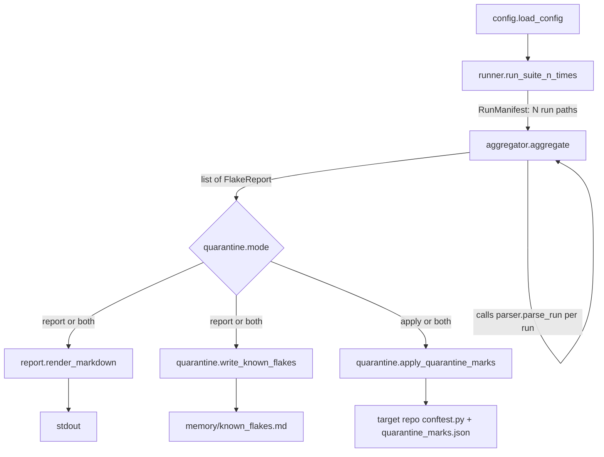

# Architecture

This documents flake-hunter as actually built. For forward-looking design
decisions and what's explicitly deferred, see `plan.md` — that's the plan
going in; this is the system after the fact.

## Overview

flake-hunter runs a target pytest suite N times as independent
subprocesses, parses each run's JSON report into per-test outcomes,
aggregates those outcomes per test node across the whole batch, and flags
any test whose fail-rate falls strictly between two configurable
thresholds. Results can be rendered as Markdown, merged into a persistent
ledger, and/or enforced as skip/xfail marks in the target repo — all
driven by one `flake-hunter --config flake_hunter.toml` invocation.

## Repo map

```
flaky-test-hunter/
├── flake_hunter/            # the package
│   ├── cli.py               # entrypoint: wires the whole pipeline (see Data flow)
│   ├── config.py            # loads/validates flake_hunter.toml
│   ├── runner.py            # spawns pytest N times, writes JSON reports + logs
│   ├── parser.py            # one pytest-json-report file -> per-test outcomes
│   ├── aggregator.py        # per-run outcomes -> list[FlakeReport]
│   ├── report.py            # FlakeReport list -> Markdown
│   ├── quarantine.py        # ledger merge + conftest skip/xfail marks
│   └── models.py            # shared frozen dataclasses (Outcome, FlakeReport, ...)
├── tests/
│   ├── unit/                 # this repo's own suite (pytest.ini testpaths)
│   └── fixtures/
│       └── flaky_demo_suite/  # ground-truth fixture flake-hunter runs *against*
├── memory/
│   └── known_flakes.md      # persistent flakiness ledger, merged/never overwritten
├── .flake_hunter/           # gitignored: raw per-run JSON reports + logs (ephemeral)
├── flake_hunter.toml        # this tool's own run config (target: the demo fixture)
├── pyproject.toml           # packaging + ruff/mypy/pytest tool config
├── plan.md                  # forward-looking roadmap + design-decision record
└── CLAUDE.md                # contributor/agent instructions for this repo
```

## Data flow



`cli.py:main()` is the orchestrator: it parses `--config`/`--suite`,
loads config, runs the suite, aggregates, and dispatches to
`report`/`quarantine` based on `config.quarantine.mode`. Any exception
raised anywhere in the chain is caught at the top level, printed to
stderr as `flake-hunter: <error>`, and turned into exit code 1 — a
missing/malformed `flake_hunter.toml` is the main case that surfaces
this way, since `config.load_config()` deliberately lets `tomllib`/`OSError`
propagate rather than degrading.

## Components

- **`config.py`** — loads and validates `flake_hunter.toml` (this tool's
  own run configuration, distinct from `pyproject.toml`'s packaging
  config) into a frozen `FlakeHunterConfig`. Validates `runs`/`parallel`
  > 0, `0.0 <= min_fail_rate <= max_fail_rate <= 1.0`, and
  `quarantine.mode` is one of `"report" | "apply" | "both"`. Malformed
  TOML or a missing file is allowed to raise — this is the one module in
  the pipeline that does *not* degrade gracefully, since a bad config is
  a user-facing error to surface, not data to route around.

- **`runner.py`** — `run_suite_n_times()` spawns pytest `runs` times
  against `suite_path`, via a `ThreadPoolExecutor(max_workers=parallel)`
  of OS subprocesses (`sys.executable -m pytest <suite> -v
  --json-report --json-report-file=...`). Each invocation writes a JSON
  report and a combined stdout+stderr log to `output_dir`. Returns a
  `RunManifest` — artifact *paths* only, never contents, so callers read
  from disk lazily instead of holding potentially thousands of lines in
  memory. A subprocess crash or a run that exceeds `timeout` (default
  300s) is recorded as a failed `RunRecord` (`exit_code` -1 or -2)
  rather than raising, so one bad run can't abort the batch.

- **`parser.py`** — `parse_run()` reads one `pytest --json-report` JSON
  file into `dict[nodeid, TestOutcome]`. Per test: `outcome` from the
  report's `outcome` field, `duration` summed across `setup`/`call`/
  `teardown` phases, `message` from the first phase (checked in
  `call`/`setup`/`teardown` order) that has a `crash` entry. A missing,
  truncated, or otherwise malformed report degrades to `{}` instead of
  raising, for the same crash-isolation reason as `runner.py`.

- **`aggregator.py`** — `aggregate()` takes a `RunManifest` and the two
  threshold floats, calls `parser.parse_run()` once per run internally,
  tallies `Outcome` counts per nodeid across the batch, and computes
  `fail_rate = (fail_count + error_count) / total_runs`. Flags a nodeid
  iff `min_fail_rate < fail_rate < max_fail_rate` (strict on both
  bounds), returning `list[FlakeReport]` sorted by nodeid. Also captures
  one sample failure message per flagged nodeid (first `FAILED`/`ERROR`
  outcome with a message, across runs).

- **`report.py`** — `render_markdown()` renders `list[FlakeReport]` as a
  Markdown table (test, fail rate, pass/fail/error/skip counts, a
  truncated/sanitized sample failure message) for CLI or CI/PR-comment
  output. Returns `"No flaky tests found.\n"` when the list is empty.

- **`quarantine.py`** — dual-mode, selected by `config.quarantine.mode`:
  - `write_known_flakes()` merges the current batch's `FlakeReport`s
    into `memory/known_flakes.md` by nodeid: existing rows get their
    counts/`last_seen`/fail-rate/sample-failure refreshed while
    `first_seen`/`suspected_cause` are preserved; new nodeids are
    appended with today's date and an `"unknown"` cause (no
    failure-classifier exists yet); rows for nodeids absent from this
    batch are left untouched, so history is never lost. Parses both the
    current 9-column ledger format and a legacy 6-column format for
    backward compatibility, and writes atomically (temp file +
    `os.replace()`) so a crash mid-write can't corrupt the ledger.
  - `apply_quarantine_marks()` writes `.flake_hunter/quarantine_marks.json`
    (nodeid -> `"skip"` or `"xfail"`, fully rewritten each call — current
    batch only, not history) and, once, appends a
    `pytest_collection_modifyitems` hook to the target repo's
    `conftest.py` that reads that JSON via `load_marks()` and applies the
    marks at collection time. Tests failing >= 50% of the time get
    `xfail`; the rest get `skip`. The conftest snippet is guarded by a
    sentinel comment so it's never duplicated across repeated runs.
  - `load_marks()` is the read-side counterpart, used by the generated
    conftest hook itself; degrades to `{}` on a missing/malformed marks
    file rather than raising.

- **`models.py`** — shared frozen dataclasses passed between every
  stage: `Outcome` (StrEnum mirroring pytest's own outcome vocabulary),
  `TestOutcome`, `RunRecord`, `RunManifest`, `FlakeReport`.

- **`cli.py`** — `main()` wires all of the above into the single
  `flake-hunter --config flake_hunter.toml [--suite <path>]` command
  described in Data flow above.

## Key design decisions

- **Strict inequality on both flakiness bounds** (`min_fail_rate <
  fail_rate < max_fail_rate`). This is intentional domain logic, not a
  boundary bug: a 0% or 100% fail-rate is a consistently passing or
  consistently failing test, not a flaky one. The shipped default
  (`min_fail_rate = 0.05` in `flake_hunter.toml`, at `runs = 20`) exists
  because strict-inequality alone doesn't filter out a single 1-in-20
  fluke — that still produces `fail_rate = 0.05 > 0.0`. Bumping the
  default threshold above zero was the fix, not new aggregator logic.
- **Crash resilience at every stage that touches a subprocess or a
  file.** `runner.py` records a failed `RunRecord` (bad exit code)
  instead of raising on subprocess crash/timeout; `parser.py` degrades
  a missing/truncated/malformed report to `{}`; `quarantine.load_marks()`
  degrades to `{}` on a bad marks file. The one deliberate exception is
  `config.py`, which lets config-loading errors propagate — a malformed
  `flake_hunter.toml` is a user mistake to surface at the top of
  `cli.main()`, not data to silently route around.
- **`RunManifest` holds paths, never contents.** `runner.py` never
  returns log or report text directly; every downstream stage
  (`parser.py`, and anything inspecting logs) reads artifacts from disk
  lazily. This keeps a batch of potentially thousands of test outcomes
  out of memory until something actually needs a specific run's data.
- **`write_known_flakes()` never overwrites ledger history.** Rows are
  merged by nodeid, not replaced wholesale: a test that stops showing up
  as flaky in a later batch keeps its row (with whatever it last said)
  rather than being silently dropped, since `memory/known_flakes.md` is
  meant to be a durable record across many runs over time, not a
  snapshot of the latest one. `apply_quarantine_marks()`'s
  `quarantine_marks.json`, by contrast, is fully rewritten every call —
  it only needs to reflect what should be quarantined *right now*.
- **The generated `conftest.py` hook is idempotent by sentinel.**
  `apply_quarantine_marks()` checks for a sentinel comment plus the hook
  function name before appending its snippet, so repeated `apply`/`both`
  runs against the same target repo never duplicate the hook.
